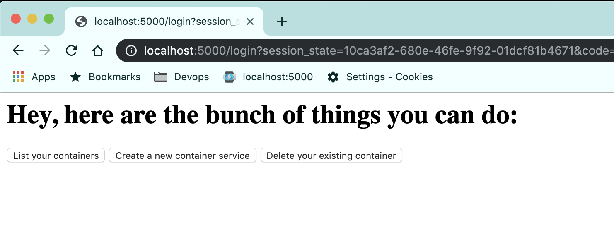

#  Compute Server

This repo includes python web application that provides on-demand container/compute service.

### Basic idea of the repo

The repo consist of a python web app developed using Flask framework, which provides compute services to its registered users. The app uses docker-py python package for communicating with host's docker daemon and manage containers.
User's can input their requirements based on which, they will be offered a compute server.
The user's are registered and authenticated with Keycloak before they can access the compute system services.

### Important python modules used

>- docker-py: Makes API call to docker daemon for creating and managing docker containers
>- Flask: Web application framework for providing Web UI to the users
>- requests: To make requests to Keycloak's endpoints
>- urllib: Encoding the URL parameters
>- jwt: For decoding Json Web tokens

### How to run?

This app uses OAuth2 with Keycloak as pluggable module for authentication.

To run this app with Keycloak for authentication, you can refer below guidelines:

1) Python packages to be installed: (Its advisable to use virtual env)

`pip3 install <package>`

- docker-py
- flask
- requests
- json
- pandas
- jwt

2) Configure OAuth2. To use Keycloak container, run:

`docker run -d -p 8080:8080 --name=mykeycloak jboss/keycloak`

3) The app requires below keycloak parameters:

- client_id
- client_secret (Required only if your Keycloak client is confidential)
- Keycloak's IP/domain to communicate
- Realm name

Note: Ensure that your Keycloak client scopes includes 'username' and client audience as mappers.

4) To run the app, you simply run the app.py file as `python app.py`.

The app defaults to listening on port 5000.

If the user is not authenticated, browser redirects it to keycloak for login.

Below the main page after successful user login.

When the user logs in, the app is designed to set access token, refresh token and username as cookies. When the users come with valid access token, they don't need to get re-authenticated.
Following the OAuth2 standards, refresh tokens are used to renew an expired access token. The expiry of these tokens is configurable under Keycloak's client settings.

### Further plans

This project is still ongoing with below plans:

- [x] Need to add a logic for filtering containers based on username and display the relavant ones per user.
- [ ] Implement a load balancer and distribute the compute system
- [ ] Add a bastion server for user's to access their container's over ssh. Currently, the app is using port forwards on its host.
- [ ] Containerize the app so that it is portable and can be deployed across multiple servers
- [ ] Codify using Terraform.
